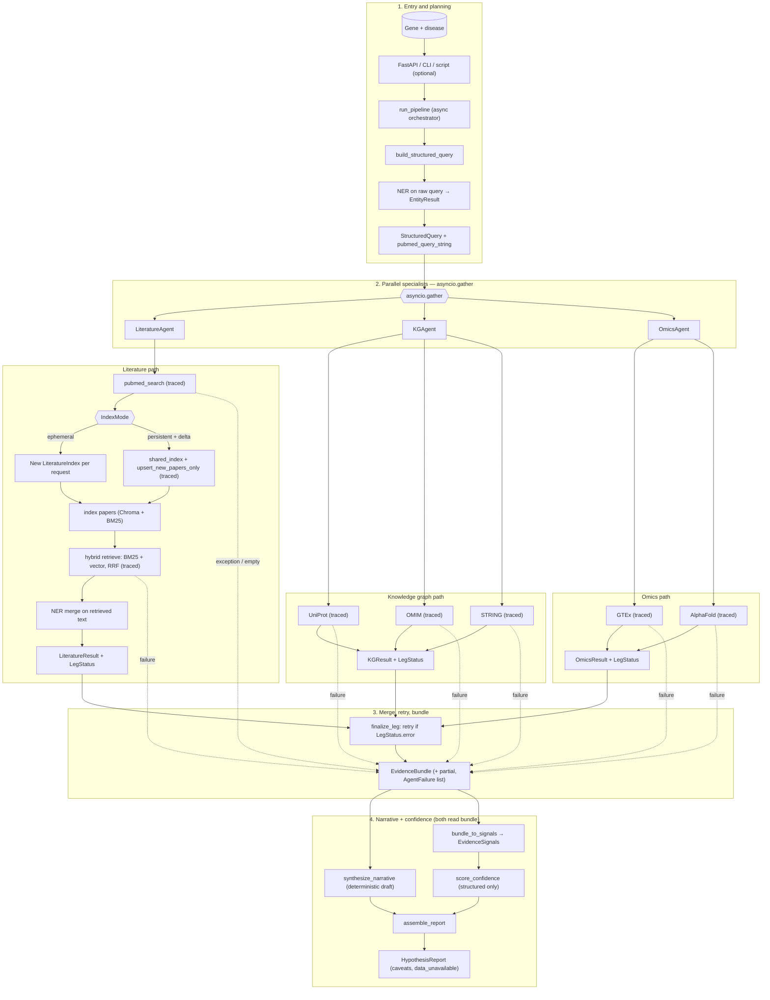

# BioTarget Scout

BioTarget Scout is an educational multi-agent biomedical discovery project. It connects **literature hybrid retrieval** (BM25 + dense vectors + RRF), **knowledge-style APIs** (UniProt, OMIM, STRING), and **omics** (GTEx, AlphaFold) behind one **async orchestrator** that merges possibly partial evidence, scores confidence from **structured signals only**, and returns a **`HypothesisReport`**.

The codebase emphasizes Pydantic schemas, per-leg status (`LegStatus`) and retries, optional **persistent Chroma** with **delta** upserts for new PMIDs, and **`traced_call`** instrumentation on external I/O.

## Goals

- Demonstrate agentic architecture with reliable tool integration.
- Combine unstructured literature + structured biomedical databases.
- Show robust engineering practices: typed schemas, graceful failures, tests.

## Concepts

- **PubMed**: literature source for papers/abstracts.
- **UniProt**: curated protein knowledge (function, sequence metadata).
- **OMIM**: gene-disease genetics catalog (requires API key for full access).
- **GTEx**: tissue expression atlas for genes.
- **AlphaFold**: predicted protein structure availability.
- **Hybrid retrieval**: combine lexical BM25 and semantic vector search.
- **RRF (Reciprocal Rank Fusion)**: merges ranked lists without score calibration.

## Architecture at a Glance

- **Entry:** `run_pipeline(target_gene, disease_context, ...)` runs the planner, then **`asyncio.gather`** over three specialists.
- **Planner:** `build_structured_query` runs **NER on the raw query**, builds **`StructuredQuery`** (including **`pubmed_query_string`**).
- **Literature:** PubMed → **`IndexMode`** (ephemeral per request vs **`persistent_with_delta`** + `shared_index` and `upsert_new_papers_only`) → index → hybrid **`retrieve`** → NER merge on retrieved text.
- **KG / Omics:** Each agent calls tools on a worker thread with **`traced_call`** where applicable; failures surface as **`LegStatus.error`** and optional **`AgentFailure`** entries.
- **Merge:** Results assemble into **`EvidenceBundle`** (`partial` when some legs are empty or failed while others succeeded). **`finalize_leg`** retries only errored legs.
- **Report:** **`bundle_to_signals`** → **`score_confidence`** runs in parallel *logically* with **`synthesize_narrative`** (both consume the bundle); **`assemble_report`** merges draft, signals, and confidence into **`HypothesisReport`** (`caveats`, **`data_unavailable`** when appropriate).

**Note:** The orchestrator is plain **`asyncio`** today. **LangGraph** is listed in `requirements.txt` for future graph wiring or LangSmith-heavy setups, not as the current runtime.

## System Flow Diagram

Narrative walkthrough: [`docs/system-flow.md`](docs/system-flow.md)



## Implemented Code Structure

```text
biotarget-scout/
  src/biotarget_scout/
    core/
      config.py
      logging.py
      tooling.py          # traced_call
    models/
      schemas.py          # EvidenceBundle, EvidenceSignals, HypothesisReport, ...
    agents/
      planner.py
      literature_agent.py
      kg_agent.py
      omics_agent.py
      synthesis.py
      confidence.py
      report_assembler.py
      orchestrator.py     # run_pipeline
    tools/
      pubmed.py
      knowledge.py
      omics.py
      ner.py
    retrieval/
      __init__.py         # IndexMode, LiteratureIndex, retrieve, RRF
      indexer.py
      hybrid.py
      fresh_fetcher.py
  tests/
    test_smoke.py
    conftest.py
    agents/
      test_orchestrator.py
      test_confidence.py
    tools/
      test_pubmed.py
      test_knowledge.py
      test_omics.py
      test_ner.py
    retrieval/
      test_hybrid.py
      test_fresh_fetcher.py
  docs/
    system-flow.md
    README.md
  requirements.txt
  .env.example
```

## What Each Implemented Module Does

### `src/biotarget_scout/core/config.py`

- Environment-backed settings (`NCBI_API_KEY`, `OMIM_API_KEY`, timeouts, etc.).

### `src/biotarget_scout/core/logging.py`

- Loguru setup for structured logs.

### `src/biotarget_scout/core/tooling.py`

- **`traced_call(tool_name, fn, ...)`** — logs latency and success/failure for observability.

### `src/biotarget_scout/models/schemas.py`

- Pydantic models for tools and the pipeline: e.g. **`PubMedPaper`**, **`LiteratureResult`**, **`KGResult`**, **`OmicsResult`**, **`StructuredQuery`**, **`EvidenceBundle`**, **`EvidenceSignals`**, **`HypothesisReport`**, **`LegStatus`**, **`AgentFailure`**.

### `src/biotarget_scout/agents/planner.py`

- **`build_structured_query`** — NER + **`pubmed_query_string`** for literature search.

### `src/biotarget_scout/agents/literature_agent.py`

- **`run_literature`** — PubMed, index (full or delta), hybrid retrieve, document NER merge; returns **`LegStatus`** and PubMed fetch count for scoring.

### `src/biotarget_scout/agents/kg_agent.py` / `omics_agent.py`

- **`run_kg`** / **`run_omics`** — async wrappers around blocking tool calls.

### `src/biotarget_scout/agents/synthesis.py`

- **`synthesize_narrative`** — deterministic narrative draft from **`EvidenceBundle`** (LLM can replace later).

### `src/biotarget_scout/agents/confidence.py`

- **`bundle_to_signals`**, **`score_confidence`** — confidence from **`EvidenceSignals`** only.

### `src/biotarget_scout/agents/report_assembler.py`

- **`assemble_report`** — merges narrative, signals, and score; sets **`data_unavailable`** and caveats.

### `src/biotarget_scout/agents/orchestrator.py`

- **`run_pipeline`** — gather, finalize/retry, build bundle, score, synthesize, assemble.

### `src/biotarget_scout/tools/pubmed.py`, `knowledge.py`, `omics.py`, `ner.py`

- PubMed Entrez, UniProt/OMIM/STRING, GTEx/AlphaFold, sciSpaCy-style entity extraction.

### `src/biotarget_scout/retrieval/indexer.py`

- **`LiteratureIndex`**, **`IndexMode`**, Chroma + BM25, **`list_pmids`**, **`add_papers`** with **`chroma_upsert_mode`** `full` or `delta`.

### `src/biotarget_scout/retrieval/hybrid.py`

- **`reciprocal_rank_fusion`**, **`retrieve`**.

### `src/biotarget_scout/retrieval/fresh_fetcher.py`

- **`papers_not_in_index`**, **`upsert_new_papers_only`** for persistent + delta workflows.

## Retrieval Workflow (standalone)

1. Collect papers (e.g., PubMed).
2. Add papers to **`LiteratureIndex`** (`add_papers`).
3. Run **`retrieve`** (BM25 + vector + RRF).
4. Receive ordered **`PubMedPaper`** hits.

The **literature agent** automates this inside **`run_pipeline`**.

## Observability

- **Per-tool tracing:** [`src/biotarget_scout/core/tooling.py`](src/biotarget_scout/core/tooling.py) wraps external calls (tool name, latency, status).
- **LangSmith:** set `LANGCHAIN_TRACING_V2=true` and `LANGCHAIN_API_KEY` when using LangChain/LangGraph callbacks.

## Environment Setup

1. Create a virtual environment and activate it.
2. Install dependencies:

```bash
python -m pip install -r requirements.txt
```

3. Copy `.env.example` to `.env` and fill in values you need.
4. API keys (as relevant):

   - `NCBI_EMAIL` (required for Entrez etiquette)
   - `NCBI_API_KEY` (optional but recommended)
   - `OMIM_API_KEY` (for OMIM results)

## SSL Certificate Note (Common on Windows/Corporate Networks)

If PubMed queries fail TLS verification, set:

```powershell
$env:SSL_CERT_FILE="C:\path\to\cacert.pem"
```

To persist:

```powershell
setx SSL_CERT_FILE "C:\path\to\cacert.pem"
```

## Quick Usage Examples

### 1) PubMed search

```python
from biotarget_scout.tools.pubmed import pubmed_search

papers = pubmed_search("PCSK9 cardiovascular", max_results=5)
print(len(papers))
```

### 2) Local index and hybrid retrieval

```python
from biotarget_scout.retrieval import LiteratureIndex, retrieve
from biotarget_scout.tools.pubmed import pubmed_search

papers = pubmed_search("PCSK9 cardiovascular", max_results=50)
index = LiteratureIndex(persist_directory=".chroma_data")
index.add_papers(papers)

hits = retrieve(index, "LDL lowering PCSK9 mechanism", top_k=10)
print([p.pmid for p in hits])
```

### 3) Full hypothesis pipeline (async)

```python
import asyncio

from biotarget_scout.agents.orchestrator import run_pipeline
from biotarget_scout.retrieval.indexer import IndexMode

async def main():
    report = await run_pipeline(
        "PCSK9",
        "cardiovascular disease",
        index_mode=IndexMode.ephemeral_per_request,
        leg_retries=2,
    )
    print(report.confidence_score, report.data_unavailable)
    print(report.evidence_summary[:200])

asyncio.run(main())
```

Importing **`run_pipeline`** from **`biotarget_scout.agents`** is also supported; submodule imports (e.g. **`biotarget_scout.agents.confidence`**) do not eagerly load the orchestrator or PubMed stack.

## Tests

```bash
python -m pytest -q
```

Focused examples:

```bash
python -m pytest tests/agents/ -q
python -m pytest tests/retrieval/ -q
```

## Current Status

- **Implemented:** config/logging/schemas/tools, hybrid retrieval + indexer modes, fresh fetcher delta upsert, full agent layer (planner, three specialists, synthesis, confidence, report assembly, **`run_pipeline`**), tracing helper, and tests (orchestrator mocks, confidence, fresh fetcher, tools, retrieval).
- **Future:** optional FastAPI route over **`run_pipeline`**, LangGraph graph definition sharing the same nodes, LLM-backed synthesis behind the same **`EvidenceBundle`** contract.
