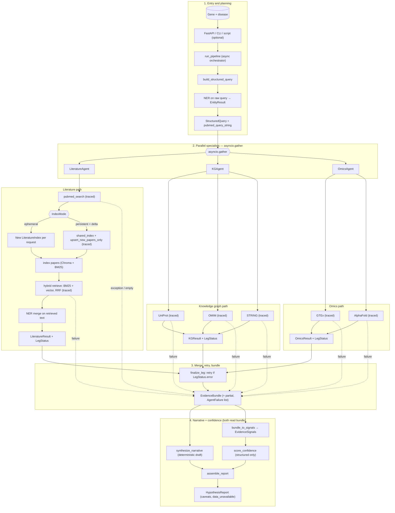

# BioTarget Scout — Documentation

This folder holds deeper design notes. **Project overview, setup, and the full module map** live in the [root README](../README.md).

## System flow

The end-to-end pipeline (orchestrator, gather/retry, **`EvidenceBundle`**, structured confidence, tracing) is diagrammed in **[`system-flow.md`](system-flow.md)**. That page is the single place we extend when the architecture changes; the root README embeds the same Mermaid for convenience.

## Quick orientation

| Topic | Location |
|--------|----------|
| Mermaid + reading guide | [`system-flow.md`](system-flow.md) |
| Install, env vars, SSL, examples | [../README.md](../README.md) |
| Orchestrator entrypoint | `src/biotarget_scout/agents/orchestrator.py` → **`run_pipeline`** |
| Schemas (`EvidenceBundle`, `HypothesisReport`, …) | `src/biotarget_scout/models/schemas.py` |
| Per-call tracing | `src/biotarget_scout/core/tooling.py` → **`traced_call`** |

## Diagram (copy of canonical flow)



## Tests

From the repo root:

```bash
python -m pytest -q
```

See [../README.md](../README.md) for scoped test commands.
