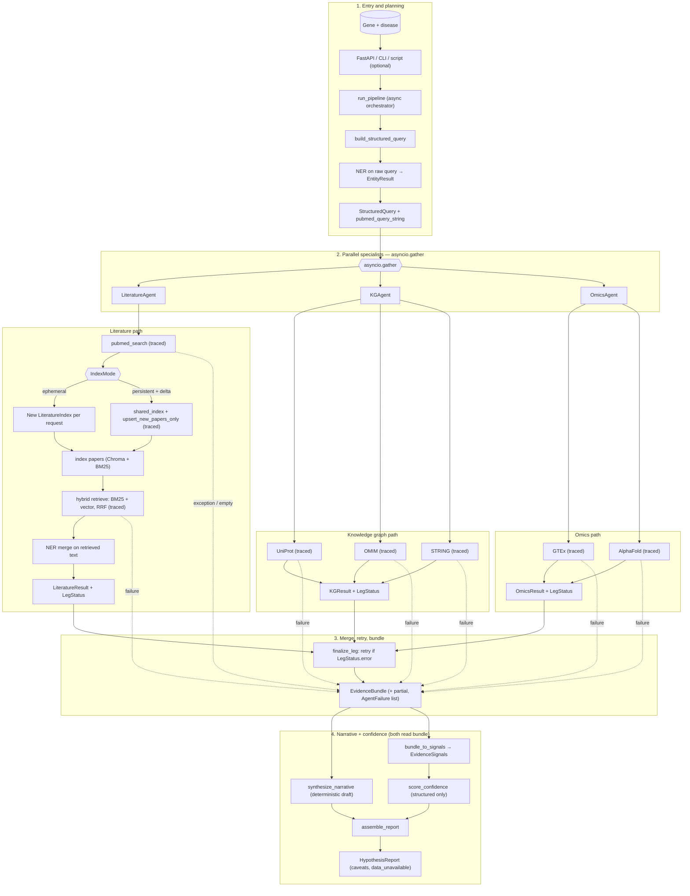

# BioTarget Scout System Flow

Target architecture: orchestrator-owned `asyncio.gather`, per-leg retries, explicit tool failures surfaced in `EvidenceBundle`, hybrid literature **IndexMode**, query NER before dispatch, parallel narrative synthesis + structured confidence scoring, and per-tool tracing.

Canonical diagram (also embedded in the [root README](../README.md)):

## Reading The Diagram

- **Orchestrator** is implemented as **`run_pipeline`** in Python (`asyncio`), not a LangGraph graph yet. LangGraph remains in dependencies for future graph-based composition or LangSmith callbacks.
- **`asyncio.gather`** launches all three legs concurrently; **`finalize_leg`** re-runs only legs that returned `LegStatus.error` (bounded retries).
- **Planner** runs **query NER first**; entities are merged again after literature retrieval from document text.
- **IndexMode**: *ephemeral* builds a fresh in-memory index per request; *persistent_with_delta* reuses `shared_index` and upserts only PMIDs not yet stored (`fresh_fetcher`).
- **Tool failures** do not bypass the merge: they show up as `LegStatus.error`, optional `AgentFailure` rows, and a **partial** `EvidenceBundle`. **ReportAssembler** still runs; it may set **`data_unavailable`** and zero confidence when structured evidence is insufficient.
- **ConfidenceScorer** uses **`EvidenceSignals` only** (counts, UniProt id, OMIM hits, STRING edges, GTEx, AlphaFold pLDDT, error/partial flags)—not LLM prose.
- **Per-tool tracing**: `traced_call` in `core/tooling.py` logs latency and ok/error for PubMed, indexing, hybrid retrieve, and each database tool.
